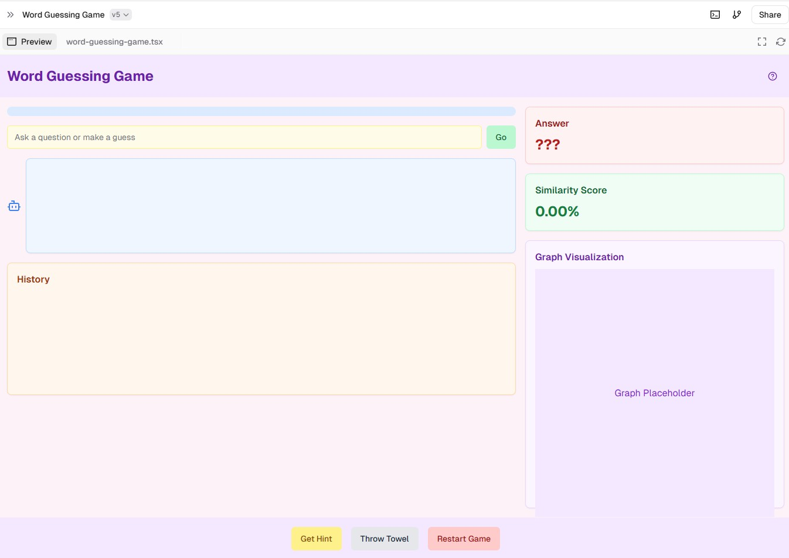

# Word Guessing Game 🎮

This project is a **Word Guessing Game** built using **React** with the **Next.js** framework. The game allows players to guess a secret word by asking yes-or-no questions or making direct guesses. The system provides responses based on the input, similarity scoring, and hints to guide the player. This game mimics a "20 Questions" style where players aim to uncover the hidden word in as few attempts as possible.

## Game Preview 🎉



## Features ✨

- **Question and Answer System**: Users can ask yes-or-no questions or make guesses to uncover the secret word.
- **Similarity Scoring**: Each guess provides a similarity score to indicate how close the guess is to the target word.
- **Hints and Answer Reveal**: Players can request hints or choose to reveal the answer if they wish to end the game.
- **Progress and History Tracking**: Displays the progress of similarity scoring and records each question/guess for reference.
- **Interactive UI**: Built with a modern and clean design, featuring interactive components like buttons, input fields, and visual cues.

## Technologies Used 🛠️

- **Next.js**: Framework for server-side rendering and optimized performance.
- **React**: JavaScript library for building the user interface.
- **Lucide-react**: Icon library for intuitive icons (e.g., Bot, Help).
- **CSS/Custom Styling**: For a responsive, user-friendly interface.

## Setup and Installation 🚀

1. **Clone the repository**:
   ```bash
   git clone <your-repo-url>
   cd h-guessing-game

2. **Install dependencies**:
   ```bash
   npm install
   ```

3. **Run the development server**:
   ```bash
   npm run dev
   ```  
   

